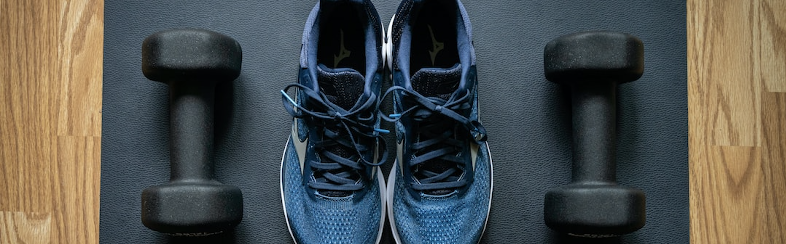
# :football:GYM TONIC
> GymTonic is a powerful and user-friendly gym routine tracker application designed to help fitness enthusiasts and athletes monitor their exercise progress and achieve their fitness goals.

## Table of Contents
* [General Info](#general-information)
* [Technologies Used](#technologies-used)
* [Features](#features)
* [Screenshots](#screenshots)
* [Setup](#setup)


## General Information
GymTonic is a comprehensive and user-friendly fitness application designed to assist individuals in effectively tracking, managing, and improving their workout routines. With a range of features tailored to fitness enthusiasts of all levels, GymTonic empowers users to achieve their fitness goals, monitor progress, and maintain motivation throughout their fitness journey.


## Technologies Used
- Spring 2.7.12, Spring Boot, Spring Data, Spring Security
- Elasticsearch - version 7.17.3
- Vue - version 3.3.4
- VueX - version 4.1.0
- TypeScript - version 5.0.4
- Axios - version 1.4.0
- D3 - version 7.8.5

## Features
List the ready features here:
- Exercise Logging: Users can easily log their daily workouts, including exercises performed, sets, reps, and weights lifted. This data is stored securely in the application's database.
- Customizable Routines: GymTonic allows users to create and customize workout routines tailored to their specific fitness goals and preferences.
- Progress Tracking: The application automatically tracks users' exercise progress over time. It generates insightful charts and graphs that display improvements and trends in performance, helping users stay motivated and focused.


## Screenshots
The project is divided into some pages.
### Landing Page

- Route: ```/```
- Description: A simple landin page, get started button redirects to ```/login```.

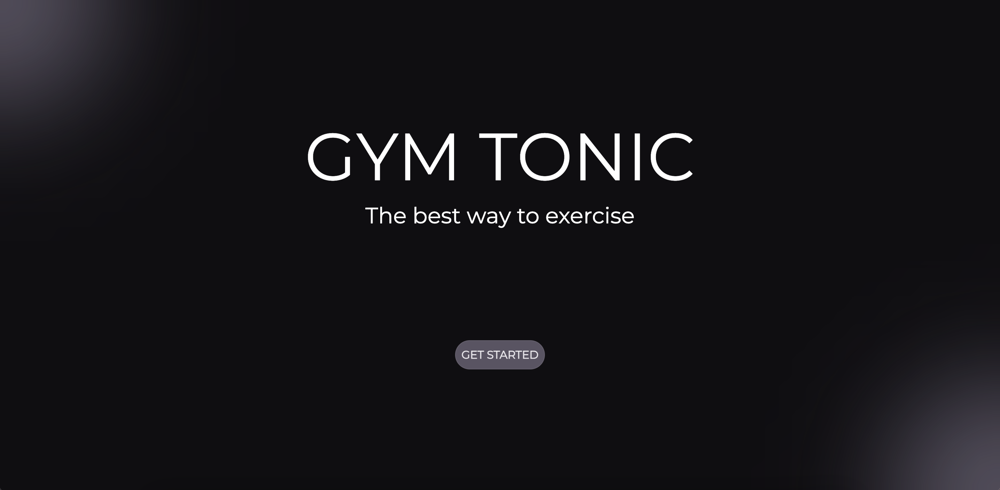

### Login Page

- Route: ```/login```
- Description: A login form, "login" redirects to ```/hub``` and "create account" to ```/register```.

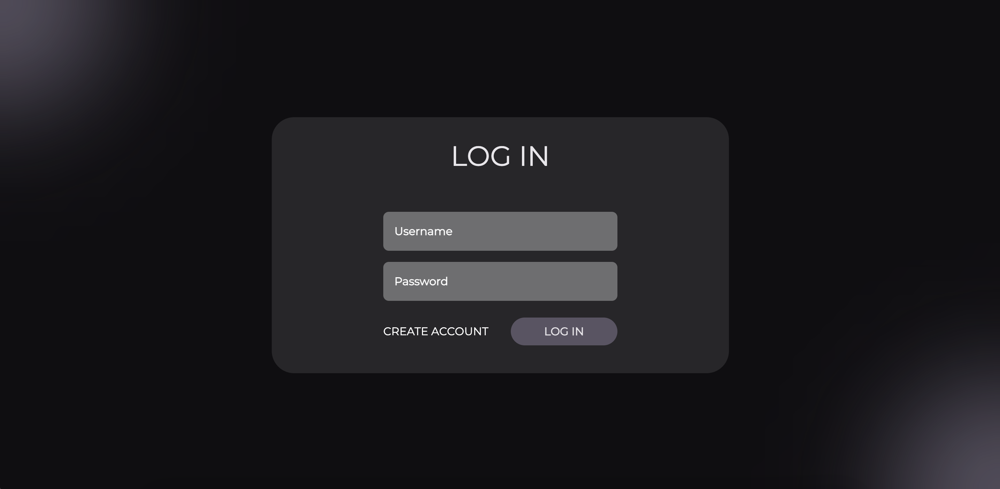
### Register Page

- Route: ```/register```
- Description: A register form, "Already have an account?" redirects to ```/login``` and "start now" redirects to ```/hub```

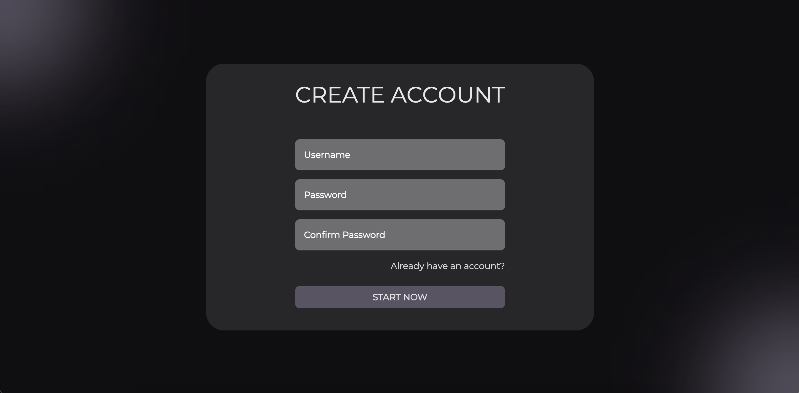
### Hub Page

- Route: ```/hub```
- Description: Here the application is divided between exercises and routines, if you click in exercises it redirects you to ```/index```. If you click routines it redirects you to ```/routine```

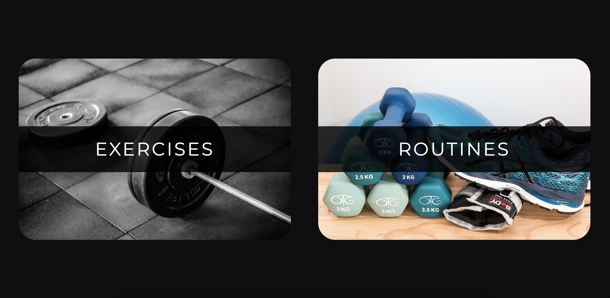
### Exercise Index Page

- Route: ```/index```
- Description: You can see all catalog of exercises, each exercise has two buttons. The arrow button redirects you to ```/exercise/:exerciseId``` and the chart button redirects you to ```/chart/exerciseId```

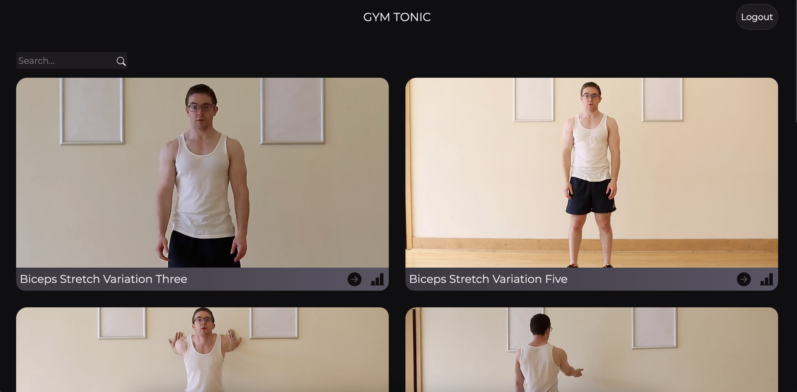
### Exercise Description Page

- Route: ```/exercise/:exerciseId```
- Description: Here you can see more information about an exercise.

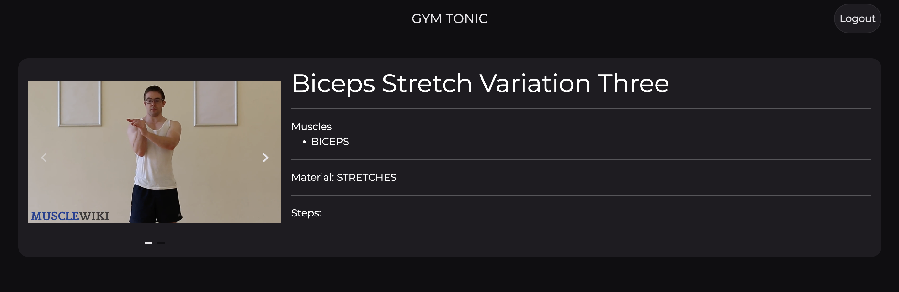
### Exercise Chart Page

- Route: ```/chart/:exerciseId```
- Description: Here you can see the progress of a exercise.

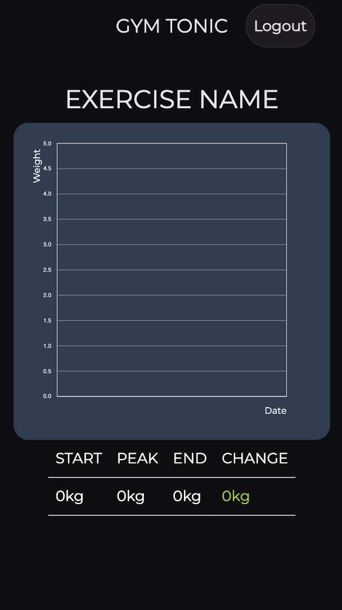
### Routine Index Page

- Route: ```/routine```
- Description: Here you can select, create and delete new routines or workouts. Moreover, you can change the day with the calendar. If you click in "Create a routine" it redirects you to ```/routine/create```. If you select a routine you can click to fill the form of sets or you can click in "Delete routine" to delete it of the database. If a workout exists, you can see it as the routines or you can delete it to delete the workout of the day.

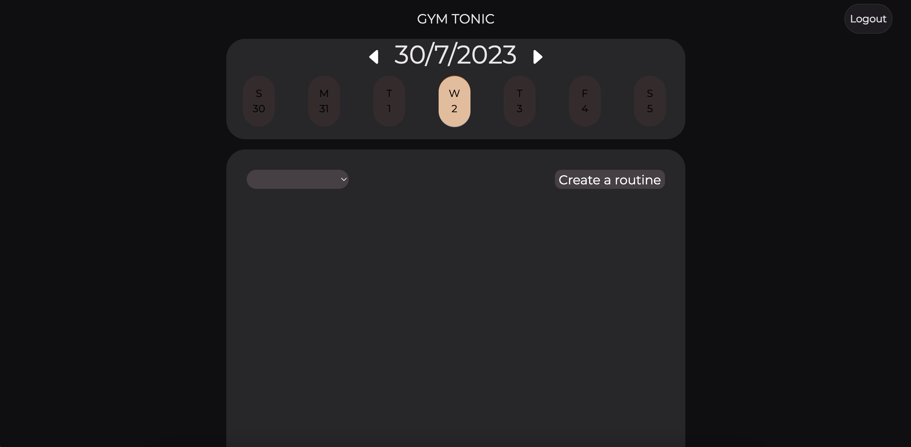
### Routine Creation Page

- Route: ```/routine/create```
- Description: Here you can select all exercises to create a routine, if you click in "next" it redirects you to ```/routine/name```.

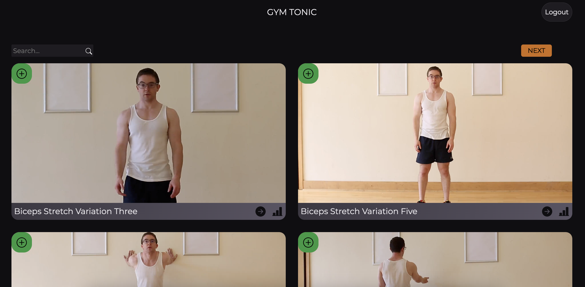
### Routine Preview Page

- Route: ```/routine/name```
- Description: Here you can preview the routine and can add a name. If you click on "Create Routine" it redirects you to ```/routine```.

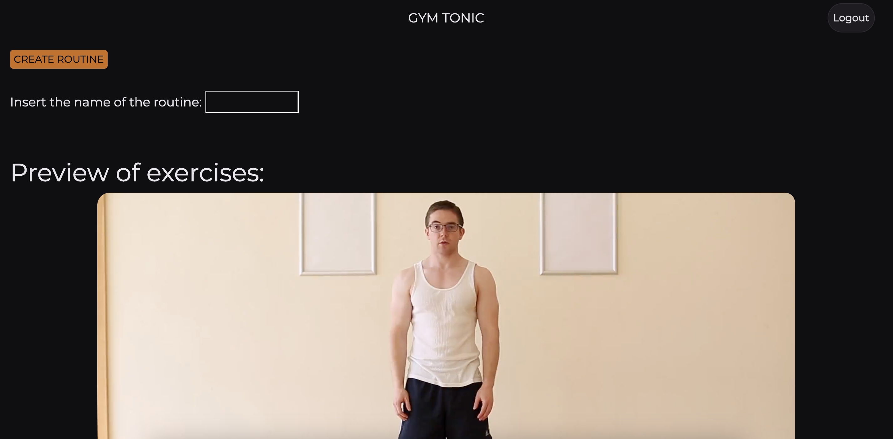
### Routine Sets Save Page

- Route: ```/routine/:routineId/sets/:date```
- Description: Here you can add all sets information. You can create and delete sets for each exercise. If you click in the "save" button, it redirects you to ```/routine```.

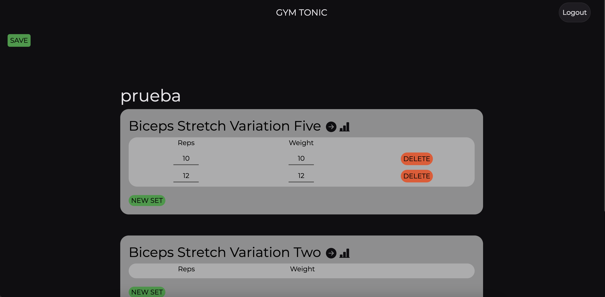
### Workout View Page

- Route: ```/workout/:routineId/sets/:date```
- Description: Here you can update all sets information. You can create and delete sets for each exercise. If you click in the "save" button, it redirects you to ```/routine```.

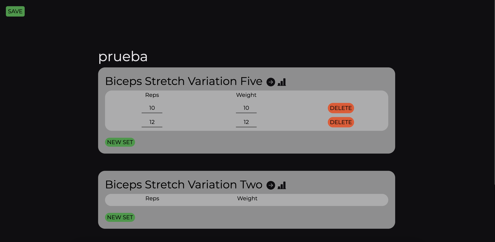
<!-- If you have screenshots you'd like to share, include them here. -->


## Setup
First of all, you have to have installed [Docker](https://www.docker.com/products/docker-desktop/) in your computer.

1. Run command line and go to the project folder.
1. Execute the command `docker compose up -d` to run the services defined in the configuration file. This command will build the necessary Docker images to run the application.
1. Now, you can access to [http://localhost:9091](http://localhost:9091) and use the app.

As additional information, we have:
- The Vue image hosted in the port 9091
- The API Documentation in the port 9090, using Swagger.

Furthermore, if you execute the command `docker compose` with `--profile monitor` you will enable the `monitor` profile  that will build the images of Kibana and MongoExpress too.

